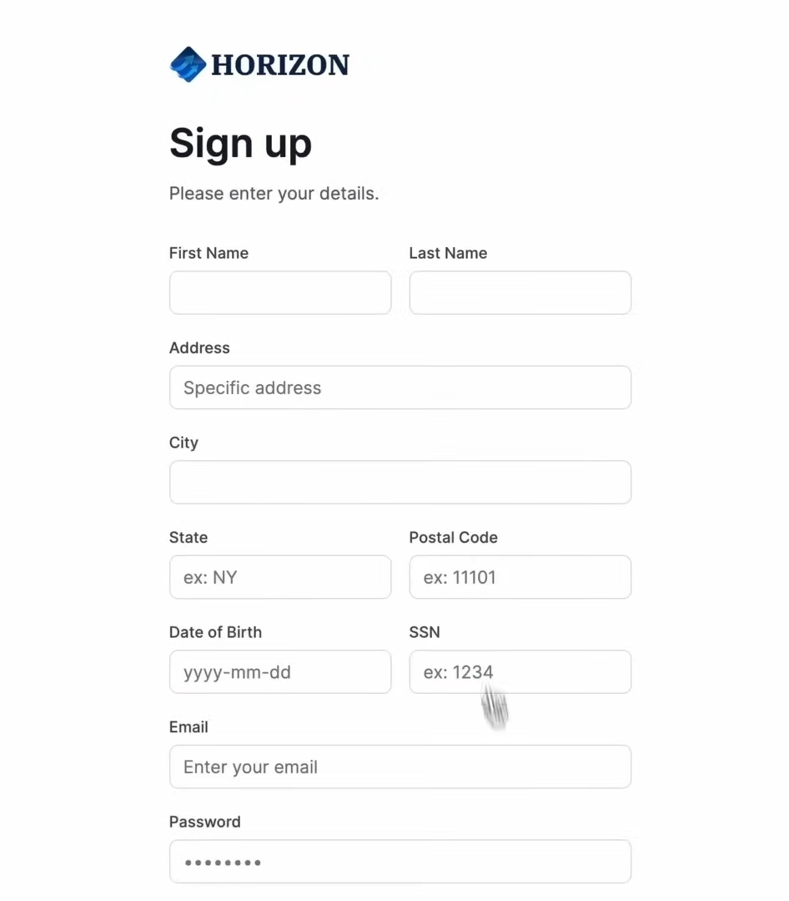
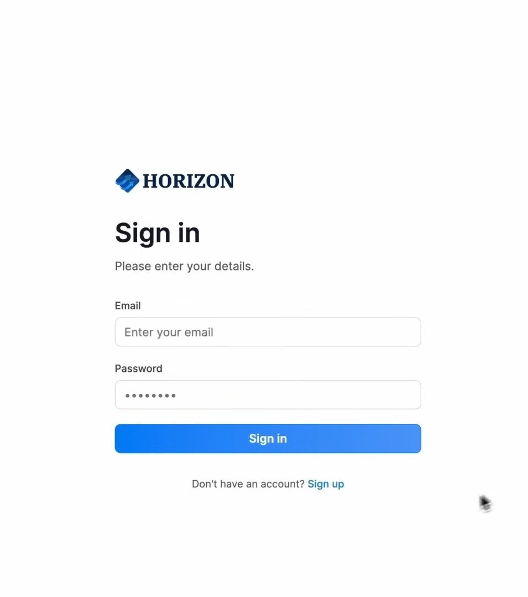
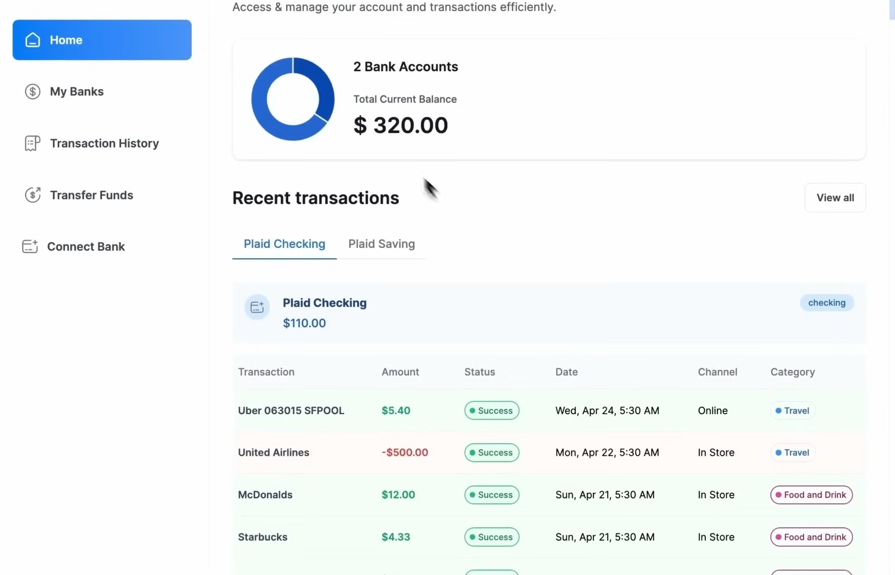

<div align="center">
  <br />
  
  <div>
    
    
    
    
  </div>

  <h3 align="center">Banking App – Modern Fintech Dashboard</h3>
</div>

## 📋 Table of Contents

1. 🤖 [Introduction](#-introduction)  
2. ⚙️ [Tech Stack](#-tech-stack)  
3. 🔋 [Features](#-features)  
4. 🤸 [Quick Start](#-quick-start)  
5. 🕸️ [Code Snippets to Copy](#-code-snippets-to-copy)  
6. 🔗 [Assets](#-assets)  
7. 🚀 [More](#-more)  
8. 📸 [Screenshots](#-screenshots)  

---

## 🤖 Introduction

**Banking App** is a modern fintech web application built with **Next.js**, **TypeScript**, and **Appwrite** that simulates a real-world banking dashboard.

It allows users to:

- Sign up & sign in securely  
- Connect multiple bank accounts using **Plaid**  
- View a unified financial dashboard  
- Transfer money using **Dwolla**  
- Track recent transactions and spending categories  

A complete stack project demonstrating authentication, API integrations, secure backend actions, and a responsive UI.

---

## ⚙️ Tech Stack

- **Framework:** Next.js (App Router)  
- **Language:** TypeScript  
- **Styling:** TailwindCSS, Radix UI, ShadCN  
- **Backend / Auth / DB:** Appwrite  
- **Banking Integrations:** Plaid  
- **Payments:** Dwolla  
- **Validation:** React Hook Form + Zod  
- **Charts:** Chart.js  

---

## 🔋 Features

- Appwrite email/password authentication  
- Connect unlimited bank accounts (Plaid sandbox)  
- Real-time dashboard with balances & graphs  
- Dwolla transfer system between users  
- Sharable encrypted account IDs  
- Responsive layout with reusable UI components  

---

## 🤸 Quick Start

### Prerequisites

Install:

- Git  
- Node.js (v18+)  
- npm / yarn / pnpm  

### Clone the Repository

```bash
git clone https://github.com/<Harsh-0812>/banking-app.git
cd banking-app
```

### Install Dependencies

```bash
npm install
# or
yarn
# or
pnpm install
```

### Setup Environment Variables

```bash
cp .env.example .env.local
```

Fill in:

- Appwrite Project ID, Endpoint, API Keys  
- Plaid Client ID, Secret  
- Dwolla API Keys  
- Encryption keys  

### Run the Project

```bash
npm run dev
```

Visit:

```
http://localhost:3000
```

---

## 🕸️ Code Snippets to Copy

(Use this section to store helpful reusable snippets like Appwrite client setup.)

---

## 🔗 Assets

Add design files or references if needed.

---

## 🚀 More

Potential future improvements:

- AI-powered spending insights  
- Budget planning tools  
- Multi-currency support  
- Dark mode  

---

## 📸 Screenshots

Make sure your images are stored here:

```
public/screenshots/login.png
public/screenshots/signup.png
public/screenshots/dashboard.png
```

### **UI Preview**

<div align="center">
  <!-- Login + Dashboard -->
  
  <br /><br />

  <!-- Sign Up Page -->
  
  <br /><br />

  <!-- Dashboard Page -->
  
</div>

---
